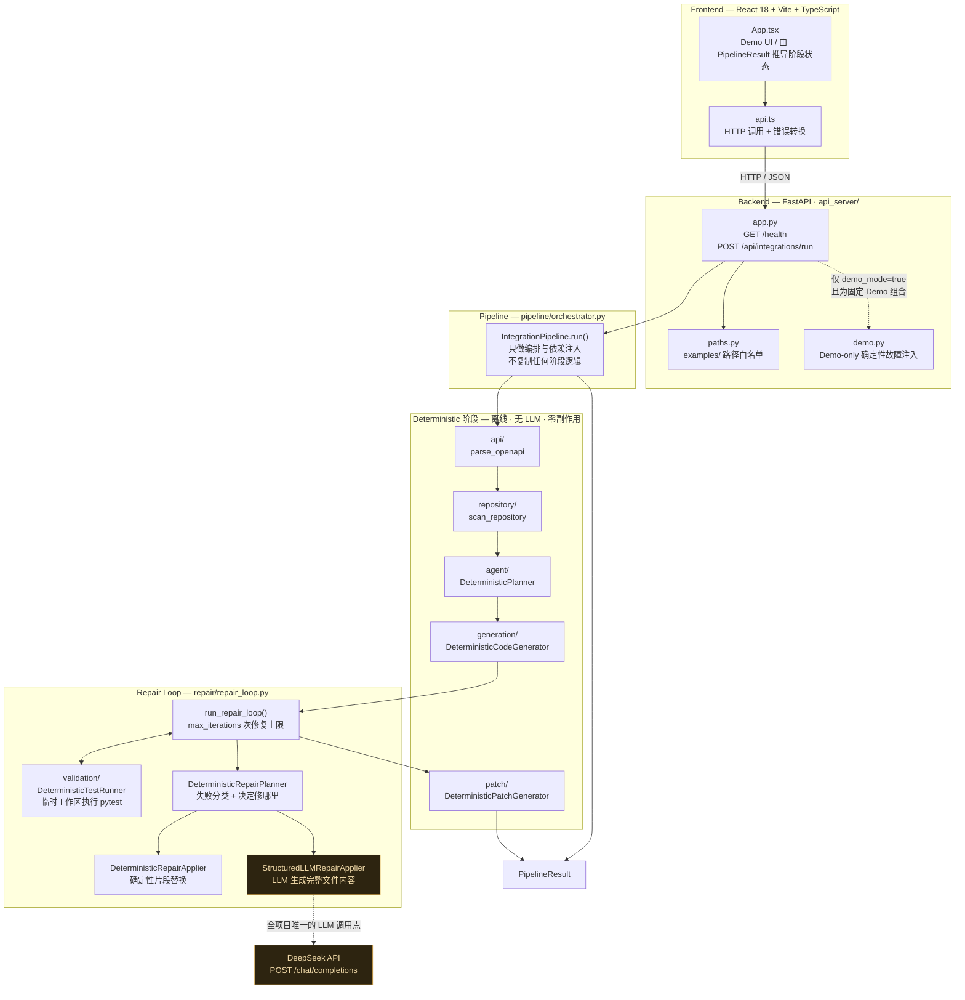

# APIForge — Autonomous API Integration Agent

**一个面向第三方 API 集成的 Coding Agent：给它一份 OpenAPI 文档和一个已有代码仓库，它自主完成"理解 → 规划 → 写代码 → 跑测试 → 失败修复 → 产出 Patch"的完整闭环。**

> 产品名：APIForge；Python 包名：`integration_agent`。

---

## 项目简介

把第三方 API 接进一个已有项目，通常是一件琐碎但容易出错的事：读文档、对接口、写 client、补异常处理、加测试、跑不通再改。APIForge 把这条链路做成了一个**可观察、可审计、可复现**的 Agent 工作流。

**输入**

| 输入 | 说明 |
|---|---|
| OpenAPI specification | OpenAPI 3.x（YAML / JSON），描述要集成的第三方 API |
| Existing code repository | 已有的 Python 项目（要被集成进去的那个仓库） |
| Integration request | 自然语言的集成需求描述 |

**输出**

| 输出 | 对应模型 |
|---|---|
| Integration plan | `IntegrationPlan` — 集成策略、端点、认证、错误处理、测试策略、风险 |
| Generated code artifacts | `GeneratedArtifacts` — 待创建/修改的文件与依赖变更 |
| Test result | `TestResult` — 真实 pytest 执行的通过/失败计数与失败详情 |
| Repair result | `RepairLoopResult` — 每轮修复计划、应用结果与迭代次数 |
| Final patch / diff | `PatchResult` — 结构化变更清单 + 真实 unified diff |

所有阶段之间只用 **Pydantic 模型**通信，全流程产物可以序列化、可以审计、可以在任意阶段被替换实现。

---

## 核心能力

| 能力 | 模块 | 实现方式 |
|---|---|---|
| **API Understanding** | `integration_agent.api` | 解析 OpenAPI 3.x 为结构化 `APIInfo`（端点 / 参数 / 请求体 / 响应 / 认证），只保留推理所需信息，不把整份文档塞进上下文 |
| **Repository Understanding** | `integration_agent.repository` | 扫描目标项目结构、依赖、源码/测试目录，并提供带行号的关键词代码检索 |
| **Integration Planning** | `integration_agent.agent` | 规则驱动的 `DeterministicPlanner`，输出完整 `IntegrationPlan` |
| **Code Generation** | `integration_agent.generation` | 从 `IntegrationPlan` 生成 client / models / exceptions / 测试等完整文件内容 |
| **Test Runner** | `integration_agent.validation` | 在**隔离临时工作区**真实执行 pytest，解析结果与失败详情，绝不触碰真实仓库 |
| **Repair Loop** | `integration_agent.repair` | 受控循环：失败分类 → 生成 `RepairPlan` → 应用修复 → 复测；迭代次数有硬上限 |
| **DeepSeek LLM Repair** | `integration_agent.repair` | `StructuredLLMRepairApplier` 通过 `DeepSeekLLMClient` 让 LLM 生成具体代码修改（严格 JSON + Pydantic 校验） |
| **Final Patch / Diff** | `integration_agent.patch` | 纯函数，把最终产物转成可审计的 `PatchResult` 与真实 unified diff |

---

## Architecture



图中每个节点都对应仓库中真实存在的模块与函数；未实现的组件不出现在图里。

---

## End-to-End Workflow

```text
                 OpenAPI specification
                          │
                          ▼
   ┌──────────────────────────────────────────────┐
   │ 1. API Understanding      api/               │  parse_openapi
   │ 2. Repository Understanding repository/      │  scan_repository
   │ 3. Integration Planning   agent/             │  DeterministicPlanner
   │ 4. Code Generation        generation/        │  DeterministicCodeGenerator
   └──────────────────────────────────────────────┘
                          │
                          ▼
   ┌──────────────────────────────────────────────┐
   │ 5. Test Runner            validation/        │  Initial Test
   └──────────────────────────────────────────────┘
                          │
              ┌───────────┴───────────┐
        passed│                       │failed
              │                       ▼
              │      ┌──────────────────────────────────┐
              │      │ 6. Repair Loop     repair/       │
              │      │   ├─ RepairPlanner  → 修哪里     │
              │      │   ├─ DeepSeek       → 怎么改     │
              │      │   └─ Re-test       → 复测       │
              │      │   （最多 max_iterations 次修复）  │
              │      └──────────────────────────────────┘
              │                       │
              └───────────┬───────────┘
                          ▼
   ┌──────────────────────────────────────────────┐
   │ 7. Final Validation + 8. Patch / Diff        │  patch/
   └──────────────────────────────────────────────┘
                          │
                          ▼
                   PipelineResult
                          │
                          ▼
              React Demo UI（真实 HTTP）
```

终止条件（`RepairLoop` 按优先级判定，无 off-by-one）：

| 状态 | 含义 |
|---|---|
| `passed` | 测试通过 |
| `not_repairable` | `RepairPlan.should_repair == False` |
| `no_progress` | 本次修复未产生任何实际改动（防止重复同一计划空转） |
| `max_iterations` | 已达到 `max_iterations` 次修复 |
| `error` | 组件抛出未预期异常（traceback 保留在 warnings） |

---

## Real Demo

仓库内的 Demo 是**真实链路**，没有任何前端定时器或假数据：

```text
React (localhost:5173)
   │  fetch + JSON
   ▼
FastAPI (127.0.0.1:8000)          ← 校验路径 → 调用 run_pipeline
   │
   ▼
APIForge Pipeline（真实执行）
   │
   ├─ Deterministic stages（plan / generate）
   ├─ pytest 在临时工作区真实执行          ← 初始测试失败
   ├─ DeepSeek Repair（真实 API 调用）      ← 生成修复
   ├─ pytest 复测                          ← 通过
   └─ Patch 生成
   │
   ▼
PipelineResult → React UI（阶段状态、测试计数、修复轮数、Patch/Diff 全部来自真实结果）
```

界面右上角的结果由 `PipelineResult` 一次性推导得出，**不假装实时**：运行期间只显示 "Processing…"，完成后一次性展示真实结果。

### Demo Mode 的故障注入

为了让"失败 → 修复 → 通过"的闭环每次演示都稳定复现，Backend 提供一个 Demo-only 的故障注入（sabotage）。它的边界被刻意收得很紧：

| 约束 | 实现 |
|---|---|
| 固定 Demo target | 只允许 `api_spec=openapi/petstore.yaml` + `project_path=demo_project`，其他组合一律 `400 DEMO_MODE_NOT_ALLOWED` |
| 固定故障注入 | 目标文件、被替换字符串、替换后的字符串**全部硬编码**在 `api_server/demo.py` |
| 不接受用户提交代码 | 请求模型里**没有**任何"目标文件"或"替换内容"字段，用户无法指定 |
| 不修改真实仓库 | 只修改内存中的 `GeneratedArtifacts`，真实仓库文件零改动（有快照测试守护） |
| 默认关闭 | `demo_mode` 默认 `false`，普通请求完全不经过该分支 |
| 注入失败即报错 | 若生成产物中找不到注入目标，直接抛错，不静默退化成"恰好通过"的假 Demo |

复现步骤见下方 [Quick Start](#quick-start)；完整演示脚本（含真实 DeepSeek 调用）见 `scripts/e2e_demo.py --llm`。

---

## DeepSeek Integration

> **DeepSeek 只负责 Repair 阶段的"具体代码怎么改"，不是整个 Pipeline 的驱动者。**

| 阶段 | 驱动方式 |
|---|---|
| API Understanding | **Deterministic** — 解析器 |
| Repository Understanding | **Deterministic** — 文件扫描 + 关键词检索 |
| Integration Planning | **Deterministic** — 规则驱动 |
| Code Generation | **Deterministic** — 模板 + 规格驱动 |
| Test Runner | **Deterministic** — 真实 pytest 执行 |
| Repair Planning（修哪里） | **Deterministic** — 失败分类 → `RepairPlan` |
| **Repair Applying（怎么改）** | **LLM** — `StructuredLLMRepairApplier` + `DeepSeekLLMClient` |
| Patch / Diff | **Deterministic** — 纯函数 |

也就是说：**默认整条流水线完全离线、无需 API Key 即可运行**；只有显式注入 `StructuredLLMRepairApplier` 时才会产生 LLM 调用。

LLM 的输出被当作**不可信输入**处理：

- 必须是严格 JSON，非法 JSON / 缺字段 / 类型错误一律拒绝，不做任何自动猜测或修正
- 修改路径必须是安全相对路径（拒绝 `..` / 绝对路径 / 盘符）
- 单次修改的文件数量、单文件内容、内容总量都有硬上限
- 原始 `GeneratedArtifacts` 永不被就地修改，只产出新对象

---

## Quick Start

前置：Python ≥ 3.10、[uv](https://docs.astral.sh/uv/)、Node.js（仅前端需要）。

以下命令在 **Windows / PowerShell** 下验证通过。

### 1. 安装与自检

```powershell
# 安装依赖（含 dev 组：pytest / ruff / httpx）
uv sync

# 运行全部测试
uv run pytest -q

# 代码检查与格式检查
uv run ruff check .
uv run ruff format --check .
```

### 2. 离线跑一次完整 Pipeline（不需要 API Key、不联网）

```powershell
uv run python scripts/e2e_demo.py
```

生成测试全绿时输出 `status: passed`。

### 3. 启动 Backend

```powershell
uv run uvicorn integration_agent.api_server.app:app --reload
```

- Backend：<http://127.0.0.1:8000>
- Swagger UI：<http://127.0.0.1:8000/docs>

健康检查（PowerShell）：

```powershell
Invoke-RestMethod -Uri http://127.0.0.1:8000/health
# status
# ------
# ok
```

### 4. 启动 Frontend

```powershell
cd frontend
npm install
npm run dev
```

打开 <http://localhost:5173>。

### 5. 演示真实 DeepSeek 修复闭环

1. 先按 [Configuration](#configuration) 配置 `DEEPSEEK_API_KEY`
2. Backend 需要重启以读取新的环境变量
3. 在浏览器中保持默认路径 `openapi/petstore.yaml` + `demo_project`
4. 同时打开 **DeepSeek Repair** 和 **Demo Mode**
5. 点击 **Run Integration**

预期看到：初始测试失败 → DeepSeek 修复 1 次 → 复测 10 passed → Patch 9 个文件可用。

等效的命令行方式：

```powershell
uv run python scripts/e2e_demo.py --llm
```

---

## Configuration

全部通过环境变量配置，仓库中不存在任何真实 Key（`.env` 已被 `.gitignore` 忽略，`.env.example` 只有空占位）。

| 变量 | 必需 | 默认值 | 说明 |
|---|---|---|---|
| `DEEPSEEK_API_KEY` | 仅 LLM Repair 需要 | — | DeepSeek API Key，**只从环境变量读取**；已配置的客户端会对所有异常信息做脱敏 |
| `DEEPSEEK_MODEL` | 否 | `deepseek-flash` | 模型 ID |
| `DEEPSEEK_BASE_URL` | 否 | `https://api.deepseek.com` | OpenAI 兼容接口地址 |
| `VITE_API_BASE_URL` | 否 | `http://127.0.0.1:8000` | 前端调用的 Backend 地址 |

PowerShell 下设置：

```powershell
$env:DEEPSEEK_API_KEY = "sk-..."      # 请勿写入任何被 git 跟踪的文件
$env:DEEPSEEK_MODEL   = "deepseek-flash"
```

> `deepseek-chat` / `deepseek-reasoner` 已于 2026-07-24 停用，当前推荐 `deepseek-flash`。

**前端永远不接触 API Key**：前端只发送 `use_llm: true`，Key 由 Backend 从服务端环境变量读取；Key 不存在时返回结构化错误 `LLM_NOT_CONFIGURED`，而不是让用户去输入 Key。

---

## Testing

当前规模（本仓库实测）：

| 检查 | 结果 |
|---|---|
| `uv run pytest -q` | **322 passed** |
| `uv run ruff check .` | All checks passed |
| `uv run ruff format --check .` | 60 files already formatted |
| `cd frontend; npm run build` | tsc 类型检查 + vite 生产构建通过 |

测试分布（16 个测试文件）：

```text
test_api_parser.py          33     test_repair_loop.py       21
test_agent_planner.py       32     test_deepseek_client.py   21
test_repair_planner.py      28     test_test_runner.py       20
test_llm_repair_applier.py  25     test_repository_code_...  18
test_code_generator.py      24     test_patch.py             18
test_api_server.py          24     test_repository_scanner   16
test_repair_applier.py      15     test_pipeline.py          12
test_smoke.py               11     test_api_schema.py         4
```

**测试设计原则**：全部测试无需 API Key、无需网络即可通过；LLM 相关测试通过注入 `FakeLLMClient` 与 monkeypatch HTTP 层完成，**自动化测试不会调用真实 DeepSeek API**。

---

## Security / Safety

| 边界 | 实现 |
|---|---|
| **Path traversal protection** | `api_server/paths.py`：只接受 `examples/` 内的相对路径，拒绝绝对路径 / Windows 盘符 / UNC / `..` 片段；`resolve()` 后仍须位于根目录内，防符号链接逃逸 |
| **Demo Mode fixed target boundary** | 故障注入只对唯一固定组合生效，目标文件与注入内容硬编码，用户无法指定（详见 [Demo Mode](#demo-mode-的故障注入)） |
| **No frontend API key** | 前端源码中不存在 `DEEPSEEK_API_KEY`；前端只发送布尔开关，Key 永远留在服务端 |
| **No arbitrary shell execution** | Backend 的业务端点只有 `GET /health` 与 `POST /api/integrations/run`（另有 FastAPI 自动生成的 `/docs`、`/redoc`、`/openapi.json`）；没有 shell / 任意文件读取 / git / Python 执行 API |
| **No real repository modification** | TestRunner 只在 `TemporaryDirectory` 工作区内写文件并执行 pytest；Repair 只改内存对象；Demo 有文件快照测试守护 |
| **LLM output validation** | LLM 返回必须是严格 JSON 并通过 Pydantic 校验；路径安全校验 + 数量/体积硬上限；非法输出直接拒绝，不猜测 |
| **No secret leakage** | API Key 只从环境变量读取，异常信息经脱敏处理；错误响应统一为 `{"error": {"code", "message"}}`，不返回 traceback 或异常原文 |
| **CORS 白名单** | 只允许本地前端 origin（`localhost:5173` / `127.0.0.1:5173`），不使用 `"*"` |

---

## Project Structure

```text
.
├── README.md
├── pyproject.toml                    # hatchling 构建；pytest / ruff 配置
├── uv.lock
├── .env.example                      # 只有空占位，无真实 Key
│
├── src/integration_agent/
│   ├── api/                          # API Understanding（parser.py + schema.py）
│   ├── repository/                   # Repository Understanding（scanner.py + code_search.py）
│   ├── agent/                        # Integration Planner（planner.py + models.py + state.py）
│   ├── generation/                   # Code Generator（code_generator.py + models.py）
│   ├── validation/                   # Test Runner（test_runner.py + models.py）
│   ├── repair/                       # Repair Loop
│   │   ├── repair_planner.py         #   失败分类 → RepairPlan
│   │   ├── repair_applier.py         #   确定性修复应用
│   │   ├── repair_loop.py            #   循环编排
│   │   ├── llm_client.py             #   LLMClient Protocol + FakeLLMClient
│   │   ├── llm_repair_applier.py     #   StructuredLLMRepairApplier
│   │   └── deepseek_client.py        #   DeepSeekLLMClient（标准库 urllib，零额外依赖）
│   ├── patch/                        # Final Patch / Diff（generator.py + models.py）
│   ├── pipeline/                     # End-to-End 编排（orchestrator.py + models.py）
│   ├── api_server/                   # FastAPI HTTP Adapter
│   │   ├── app.py                    #   两个端点 + 结构化错误处理
│   │   ├── paths.py                  #   路径白名单校验
│   │   ├── models.py                 #   请求/响应契约
│   │   └── demo.py                   #   Demo-only 故障注入
│   └── tools/                        # 早期占位（已被 generation/ 与 validation/ 取代）
│
├── tests/                            # 16 个测试文件 / 322 个测试
│
├── scripts/
│   ├── e2e_demo.py                   # 命令行 E2E 演示（--llm 启用真实 DeepSeek）
│   └── smoke_deepseek.py             # 手动 DeepSeek 连通性验证（pytest 不执行）
│
├── examples/
│   ├── openapi/petstore.yaml         # OpenAPI 3.x 示例 spec
│   └── demo_project/                 # 被集成的目标项目 fixture
│
└── frontend/                         # React 18 + Vite 5 + TypeScript Demo UI
    ├── src/App.tsx                   #   主界面 + 由 PipelineResult 推导阶段状态
    ├── src/api.ts                    #   Backend HTTP client
    └── src/data.ts                   #   阶段定义与默认输入
```

---

## Technical Design

**Protocol-based dependency injection**
每个阶段都定义 `Protocol`（`IntegrationPlanner` / `CodeGenerator` / `TestRunner` / `RepairPlanner` / `RepairApplier` / `RepairLoop` / `LLMClient` / `PatchGenerator` / `Pipeline`），Pipeline 只依赖接口。因此"确定性实现"与"LLM 实现"可以在不改动编排代码的前提下互换：

```python
from integration_agent.pipeline import run_pipeline
from integration_agent.repair import DeepSeekLLMClient, StructuredLLMRepairApplier

result = run_pipeline(
    "examples/openapi/petstore.yaml",
    "examples/demo_project",
    repair_applier=StructuredLLMRepairApplier(DeepSeekLLMClient(json_mode=True)),
)
```

**Pydantic structured contracts**
阶段之间不传自由文本，只传 Pydantic 模型。好处是全流程可序列化、可校验、可存证；LLM 的输出也必须先过 Pydantic 校验才能进入下一步。

**Deterministic offline components**
Planning / Generation / Patch 三个阶段的输出**完全确定性**：无随机数、无时间戳、无 UUID、无无序集合，同样的输入得到字节级相同的输出（已跨 `PYTHONHASHSEED` 验证），这让回归测试和 diff 比较都变得可靠。

唯一的不确定性来自 TestRunner —— 它**真实执行** pytest 并记录实际耗时，因此 `TestResult.duration` 每次运行都不同。这是有意为之：测试结果必须反映真实执行，不能伪造。

**Isolated test execution**
TestRunner 在 `TemporaryDirectory` 中重建工作区后执行 pytest：真实执行、真实解析结果，但绝不写入用户仓库；依赖只做离线可导入性检查，不联网安装。

**Bounded repair iterations**
`max_iterations = 3` 表示最多执行 3 次**修复**（初始测试不算）。循环还有 `no_progress` / `not_repairable` 等提前终止条件，防止空转。

**LLM repair adapter**
`StructuredLLMRepairApplier` 把 `RepairPlan` + `TestResult` + 当前产物组装成 prompt，要求 LLM 返回严格 JSON 的完整文件内容，再逐层校验后应用。LLM 只被允许改它被要求改的东西。

**Patch generation**
`DeterministicPatchGenerator` 是纯函数：create 文件生成真实 unified diff，modify 片段在没有原始文件内容时**如实标记 `diff_available=False`** 并保留结构化信息，绝不伪造 diff。

---

## Limitations

诚实说明当前边界：

- **Code Generator 仍是确定性实现**：它按 `IntegrationPlan` 生成结构完整的 client / models / exceptions / 测试，但并非由 LLM 自由创作。LLM 目前只用在 Repair 阶段。
- **LLM 只用于 Repair**：Planning 与 Generation 都是规则驱动的，不存在"整个 Pipeline 由 LLM 驱动"这回事。
- **modify 产物的 patch 依赖原始文件内容**：没有提供 `original_files` 时，modify 片段只能给出结构化信息（`diff_available=False`），无法生成完整 diff。
- **Demo Mode 是演示机制，不是生产功能**：故障注入的唯一目的是让"失败 → 修复"闭环在演示中稳定复现，它不参与任何正常请求。
- **TestRunner 只运行生成的测试**：不跑目标仓库原有的完整测试套件，"集成正确"的判定范围限于生成产物自身的行为。
- **Repository Understanding 是关键词检索**：不是向量检索，也没有调用图/依赖图分析。
- **尚无并发与缓存**：Pipeline 是单次同步执行，没有任务队列、持久化或重试调度。

---

## Roadmap

以下是**尚未实现**的方向，按优先级排列：

- [ ] **LLM-driven Generation** — 让 Code Generator 也能接入 LLM，生成更贴合目标项目风格的代码
- [ ] **LLM-driven Planning** — 让 `IntegrationPlan` 参考更丰富的仓库上下文
- [ ] **Semantic code retrieval** — 用嵌入检索替换关键词检索，提升 Repository Understanding 的召回
- [ ] **Real dependency resolution** — 在受限网络中做真实的依赖安装与版本求解
- [ ] **Git-aware patch application** — 生成可直接 `git apply` 的补丁并支持 dry-run 校验
- [ ] **More language targets** — 当前只面向 Python 项目
- [ ] **Task queue / async runs** — 长任务的异步执行与进度流式反馈（当前刻意不做假实时）

---

## License

本仓库为个人项目，未附 License 文件。
