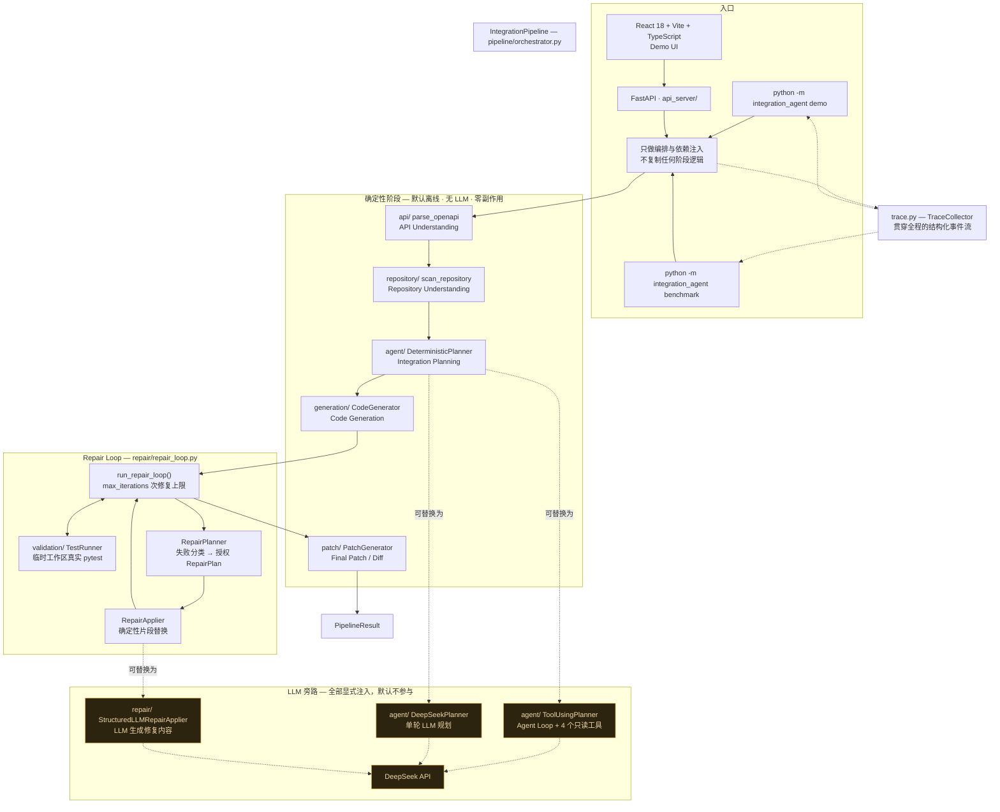

# APIForge

Autonomous API Integration Agent

An AI software engineering agent that turns a third-party OpenAPI specification and an existing Python repository into a validated integration patch through planning, code generation, testing, repair, and verification.

> 产品名：APIForge；Python 包名：`integration_agent`。

---

## 项目简介

把第三方 API 接进一个已有项目，通常是一件琐碎但容易出错的事：读文档、对接口、写 client、补异常处理、加测试、跑不通再改。APIForge 把这条链路做成了一个**可观察、可审计、可复现**的 Agent 工作流。

**输入**

| 输入 | 说明 |
|---|---|
| OpenAPI specification | OpenAPI 3.x（YAML / JSON），描述要集成的第三方 API |
| Existing code repository | 已有的 Python 项目（要被集成进去的那个仓库） |
| Integration request | 自然语言的集成需求描述 |

**输出**

| 输出 | 对应模型 |
|---|---|
| Integration plan | `IntegrationPlan` — 集成策略、端点、认证、错误处理、测试策略、风险 |
| Generated code artifacts | `GeneratedArtifacts` — 待创建/修改的文件与依赖变更 |
| Test result | `TestResult` — 真实 pytest 执行的通过/失败计数与失败详情 |
| Repair result | `RepairLoopResult` — 每轮修复计划、应用结果与迭代次数 |
| Final patch / diff | `PatchResult` — 结构化变更清单 + 真实 unified diff（可 `git apply`） |
| Execution trace | `TraceEvent` — 全程结构化事件流（阶段、工具调用、测试、修复） |

所有阶段之间只用 **Pydantic 模型**通信，全流程产物可以序列化、可以审计、可以在任意阶段被替换实现。

---

## 核心能力

| 能力 | 模块 | 实现方式 |
|---|---|---|
| **API Understanding** | `integration_agent.api` | 解析 OpenAPI 3.x 为结构化 `APIInfo`（端点 / 参数 / 请求体 / 响应 / 认证），只保留推理所需信息，不把整份文档塞进上下文 |
| **Repository Understanding** | `integration_agent.repository` | 扫描目标项目结构、依赖、源码/测试目录，并提供带行号的关键词代码检索；拒绝符号链接越界 |
| **Integration Planning** | `integration_agent.agent` | 三种可替换实现：规则驱动的 `DeterministicPlanner`（默认、离线）、单轮 LLM 的 `DeepSeekPlanner`、走 Agent 回路自主调用工具的 `ToolUsingPlanner` |
| **Agent / Tool Calling** | `integration_agent.agent` + `integration_agent.tools` | `AgentLoopRunner` 多轮回路 + 4 个只读工具（`inspect_api` / `inspect_project` / `search_code` / `read_file`），程序侧对 LLM 判断做逐条 grounded 校验 |
| **Code Generation** | `integration_agent.generation` | 从 `IntegrationPlan` 生成 client / models / exceptions / 测试等完整文件内容，字符串一律安全转义 |
| **Test Runner** | `integration_agent.validation` | 在**隔离临时工作区**真实执行 pytest 子进程，结果统计只能来自 runner 自有插件，绝不触碰真实仓库 |
| **Repair Loop** | `integration_agent.repair` | 受控循环：失败分类 → 授权 `RepairPlan` → 应用修复 → 复测；迭代次数有硬上限与空转防护 |
| **LLM Repair** | `integration_agent.repair` | `StructuredLLMRepairApplier` 通过 `DeepSeekLLMClient` 让 LLM 生成具体代码修改（严格 JSON + Pydantic 校验） |
| **Final Patch / Diff** | `integration_agent.patch` | 纯函数，把最终产物转成可审计的 `PatchResult` 与真实 unified diff |
| **Execution Trace** | `integration_agent.trace` | 内存 `TraceCollector` 记录全程结构化事件（脱敏、限长、不写盘），驱动 CLI 展示 |
| **Pipeline Consistency Benchmark** | `integration_agent.benchmark` | 真实跑 Pipeline 的离线确定性基准，4 个固定 case + 动态指标；测的是工程闭环自洽，不是集成质量 |
| **CLI Demo / Benchmark** | `integration_agent.cli` | `python -m integration_agent demo` / `benchmark`，纯标准库 |

---

## Architecture



图中每个节点都对应仓库中真实存在的模块与函数；未实现的组件不出现在图里。

---

## End-to-End Workflow

```text
OpenAPI spec + Repository + Request
              │
              ▼
       API Understanding
              │
              ▼
    Repository Understanding
              │
              ▼
      Integration Planner ──────────────────┐
              │                             ├─ 默认 DeterministicPlanner（离线）
              ▼                             └─ 可替换 DeepSeekPlanner / ToolUsingPlanner
       Code Generator
              │
              ▼
      GeneratedArtifacts
              │
              ▼
         Test Runner
              │
          ┌───┴───┐
        PASS     FAIL
          │        │
          │        ▼
          │    Repair Loop ──► Re-test ──┐
          │        │                     │
          └────────┴─────────────────────┘
                   │
                   ▼
             Final Patch
                   │
                   ▼
   PipelineResult（Execution Trace 贯穿全程）
```

终止条件（`RepairLoop` 按优先级判定，无 off-by-one）：

| 状态 | 含义 |
|---|---|
| `passed` | 测试通过 |
| `not_repairable` | `RepairPlan.should_repair == False` |
| `no_progress` | 本次修复未产生任何实际改动（防止重复同一计划空转） |
| `max_iterations` | 已达到 `max_iterations` 次修复 |
| `error` | 组件抛出未预期异常（traceback 保留在服务端日志） |

---

## Agent 在哪里发挥作用

**默认路径里没有 LLM。** 这是设计，不是缺憾：确定性 Planner 负责普通集成，LLM 只在两类地方被显式接入，且都是同一条 Pipeline 契约上的可替换实现：

| 实现 | 路径 | 什么时候用 |
|---|---|---|
| `DeterministicPlanner` | 规则驱动，离线 | 默认；可复现、零成本 |
| `DeepSeekPlanner` | 单轮 LLM 规划，证据由程序预先检索好 | 需要 LLM 判断集成策略时 |
| `ToolUsingPlanner` | **Agent 回路**：LLM 自己决定还要看什么 | 需要 Agent 自主收集证据时 |

`ToolUsingPlanner` 是"Agent 在哪里发挥作用"的完整答案——它跑一条真正的 Agent Loop：

```text
LLM Agent
   │
   ├── inspect_api        只读：结构化 API 摘要
   ├── inspect_project    只读：仓库结构摘要
   ├── search_code        只读：带行号的关键词检索
   └── read_file          只读：受长度限制的文件内容
```

程序侧的分工没有放松：LLM 负责**判断**（集成目标、策略、文件清单、测试策略），程序负责**约束**（端点必须在真实 `APIInfo` 中解析、事实字段由 `PlannerState` 回填、路径 / 依赖 / 凭据逐条对照证据），所有被丢弃的内容都写进 `IntegrationPlan.warnings`，不静默吞掉任何东西。回路本身的每次 LLM 调用、每次工具调用都被 Execution Trace 记录。

---

## Test Runner 为什么可信

`integration_agent.validation.DeterministicTestRunner` 不只是"跑一下 pytest"：

```text
GeneratedArtifacts
        ↓
Temporary Workspace        # 临时目录重建完整工作区
        ↓
Generated source + tests
        ↓
pytest subprocess          # 真实子进程，受 timeout 限制
        ↓
runner-owned pytest session statistics   # 计数只能来自 runner 自有插件
        ↓
TestResult
```

- **不修改真实 Repository**：写文件与执行 pytest 全部发生在 `TemporaryDirectory` 工作区内，真实仓库零改动（有快照测试守护）。
- **stdout / stderr 完整捕获**，随结果返回；**exit code** 是 pytest 进程的真实退出码。
- **`timeout`** 硬上限，超时即中止子进程。
- **passed / failed / errors / skipped** 计数来自 runner 自有的 pytest 插件（经环境变量传出的会话统计），**不能由 stdout 伪造**——输出写什么都改变不了计数。
- **failure details**：失败用例名、文件、行号、错误消息逐条结构化返回。
- **zero-test 防护**：收集不到任何测试用例时不是"通过"，而是如实报告。
- **子进程环境受限**：环境变量白名单，隔离宿主环境。
- **pytest 结果校验**：runner 拒绝"进程没跑但结果文件看起来正常"这类不一致状态。

`TestResult` 是测试结论的唯一结构化事实来源；Execution Trace 里的 `test_completed` 事件只是它的摘要镜像。

---

## Repair Loop 如何工作

```text
TestResult
    │
    ├── passed ──────────────────► Final Patch
    │
    └── failed
           │
           ▼
      Repair Planner            # 失败分类 → 授权 RepairPlan（文件白名单）
           │
           ▼
      Authorized Changes
           │
           ▼
         Re-test
           │
           ├── passed ──► Final Patch
           │
           └── failed ──► bounded retry（max_iterations 硬上限 + no_progress 防护）
```

要诚实说明的边界：

- **当前确定性修复器不会凭空合成代码。** 它做的是失败分类与**授权过的确定性替换**；遇到需要综合新代码的修复，如实标记 `no_progress` 并给出原因，而不是假装修好了。
- **LLM 修复走独立的受控接口**：`StructuredLLMRepairApplier` 要求 LLM 返回严格 JSON 的完整文件内容，经路径安全校验、数量/体积硬上限与 Pydantic 校验后才应用；原始产物永不被就地修改。
- 确定性修复与 LLM 修复实现同一个 `RepairApplier` 协议，在 Pipeline 装配处互换。

---

## Execution Trace

APIForge 用 `trace.py` 记录**结构化执行事件**，贯穿：

```text
API Understanding
Repository Understanding
Planner（含 planning / llm 调用）
Agent Tool Calls（tool_called / tool_completed）
Code Generation
Test Runner
Repair Loop
Final Patch
```

```text
TraceCollector
    ↓
TraceEvent（stage / event_type / message / metadata / duration / status）
    ↓
CLI 展示 / 测试断言 / 任何外部 observability
```

设计要点：

- **旁路观测，不改业务**：`trace: TraceCollector | None = None` 可选参数 + contextvar 作用域传播，各阶段组件的签名一字未改；不打开作用域时 `emit()` 是空操作，行为与没有 trace 时完全一致。
- **不记录 API key / token / password / secret**（按键名脱敏，命中即整值替换为 `***`）。
- **不记录完整 prompt、完整 LLM response、完整源码、完整 diff、绝对 Repository root**——只记工具名、计数、状态、耗时。
- **metadata 有大小与深度限制**：单字符串 200 字符截断、嵌套深度上限 4、未知类型降级为 `<TypeName>`、集合排序归一，保证事件可 JSON round-trip。
- 事件类型是封闭词汇表；写错的埋点只丢事件（留 DEBUG 日志），**不会**让业务运行失败。全仓库埋点由测试静态扫描守护。

---

## CLI Demo

```bash
python -m integration_agent demo              # 离线确定性闭环：解析 → 规划 → 生成 → 测试全绿
python -m integration_agent demo --sabotage   # 注入确定性测试失败 → 真实走一遍 Repair Loop
python -m integration_agent demo --no-color   # 关闭 ANSI 颜色（管道 / CI 自动关闭）
```

- `demo` 以 8 阶段表格展示一次真实集成（阶段状态、测试计数、修复尝试、patch 概要全部来自 Execution Trace），最终 SUCCESS / FAILED 直接取自 `PipelineResult.status`，CLI 不自己推断任何运行状态。
- `--sabotage` 复用 Demo-only 注入器（`api_server/demo.py`，目标与内容全部硬编码）把生成测试里的一个断言改错。它是**演示机制**：测试真的失败、Repair 真的尝试、最终如实显示 FAILED——用来展示 Test Runner → Repair Loop → 失败收尾的完整链路，不代表真实业务失败。
- 如果某次运行没有触发 Repair，输出如实显示 `skipped: tests passed`，不伪造修复过程。

---

## Pipeline Consistency Benchmark

这个 Benchmark 用**真实 Pipeline** 反复跑同一批离线 case，检验的是 APIForge 这条确定性工程闭环**自身**是否自洽：

| 它验证什么 | 怎么验证 |
|---|---|
| 确定性执行 | 同一个 case 连续跑两次，结构化结果必须逐项一致（`deterministic_repeat`） |
| Pipeline 一致性 | 同一份输入走完 Planning → Generation → Patch → Test Runner，得到同样的产物与同样的计数 |
| 基于 trace 的指标 | 每个数字都从 `BenchmarkResult` 与 execution trace 现场算出，代码里没有任何写死的成功率 |
| 预期失败的处理 | 注入确定性错误后测试**真的**失败，流程如实记录，而不是把它粉饰成通过（`petstore_sabotage`） |
| 修复无进展的诚实性 | Repair 真尝试；真无进展时如实报 `no_progress`，不伪造修复过程 |
| 可重复性 | 换进程、换 `PYTHONHASHSEED` 都得到同样的比率与计数（耗时是墙钟时间，随机器波动） |

**它不衡量什么**：API 集成质量、Agent 的修复能力、LLM 路径的效果。这四个 case 全部离线、不联网、不调 LLM，样本量小且是刻意挑选的，下面的百分比**不是**集成成功率，也**不是** Agent 的修复成功率。

```bash
python -m integration_agent benchmark
```

```text
APIForge Benchmark
========================================

Cases:               4
Passed:              3
Failed:              1
Errors:              0

Pass rate:           75.0%
Repair trigger rate: 25.0%
Repair recovery rate: 0.0%

Repair triggered:    1
Repair recovered:    0

Avg duration:        0.53s
Avg repair attempts: 0.25

Cases
----------------------------------------
petstore_success         PASSED
petstore_sabotage        FAILED
multi_file_generation    PASSED
deterministic_repeat     PASSED
```

当前结果：**4 个确定性 case / 5 次真实 Pipeline 执行**，3 passed / 1 failed / 0 errors，pass rate 75.0%，repair trigger rate 25.0%，repair recovery rate 0.0%，平均修复次数 0.25，平均耗时约 0.5s（墙钟时间，随机器波动；上面的比率与计数是确定性值，反复运行不变）。

> 输出里的 `Pass rate` / `Repair trigger rate` / `Repair recovery rate` 都是**case 层面的比率**——这几条 case 里有多少条跑绿了、失败的那条有没有触发 Repair、有没有被修好。它们不是 API 集成成功率，也不代表 Agent 的修复能力：`petstore_sabotage` 里的错误是**故意注入**的，它贡献的那个 0% 恰恰是"如实报告失败"这一设计目标被达成的证据。
>
> These metrics are from the current four deterministic local benchmark cases and are not intended to represent general API integration success rates. 它们测量的是确定性工程闭环（不联网、不调 LLM），且全部指标从 `BenchmarkResult` 动态计算，代码里没有任何写死的成功率。

| case | 内容 |
|---|---|
| `petstore_success` | 正常成功：Petstore 全流程集成，测试全绿（10 passed，9 个文件 patch） |
| `petstore_sabotage` | 正常失败：注入确定性错误 → 测试真失败（9/1）→ Repair 真尝试 1 次 → 如实 no_progress |
| `multi_file_generation` | 多文件生成：`max_endpoints=2` 的另一规模生成（8 passed），验证多份源码 + 测试产物全绿 |
| `deterministic_repeat` | 确定性：同一 case 连续执行两次，核心结构化结果（status / 测试计数 / 修复次数 / patch 文件数 / 生成计数）必须逐项一致，不一致即判失败 |

Benchmark 不修改真实仓库（运行前后有全量快照测试比对），case 路径按 `examples/` 安全规则解析，单 case 崩溃被收成 `error` 结果而不中断整轮。

---

## Real Demo（Web）

仓库内的前端 Demo 是**真实链路**，没有任何假数据：

```text
React (localhost:5173)
   │  fetch + JSON
   ▼
FastAPI (127.0.0.1:8000)          ← 校验路径 → 调用 run_pipeline
   │
   ▼
APIForge Pipeline（真实执行）
   │
   ├─ Deterministic stages（plan / generate）
   ├─ pytest 在临时工作区真实执行
   ├─ （demo_mode 时）确定性故障注入 + LLM Repair（真实 API 调用）
   ├─ pytest 复测
   └─ Patch 生成
   │
   ▼
PipelineResult → React UI（阶段状态、测试计数、修复轮数、Patch/Diff 全部来自真实结果）
```

界面状态由 `PipelineResult` 一次性推导得出，**不假装实时**：运行期间只显示 "Processing…"，完成后一次性展示真实结果。

### Demo Mode 的故障注入

为了让"失败 → 修复 → 通过"的闭环每次演示都稳定复现，Backend 提供 Demo-only 的故障注入（sabotage），边界被刻意收得很紧：

| 约束 | 实现 |
|---|---|
| 固定 Demo target | 只允许 `api_spec=openapi/petstore.yaml` + `project_path=demo_project`，其他组合一律拒绝 |
| 固定故障注入 | 目标文件、被替换字符串、替换后的字符串**全部硬编码**在 `api_server/demo.py` |
| 不接受用户提交代码 | 请求模型里**没有**任何"目标文件"或"替换内容"字段 |
| 不修改真实仓库 | 只修改内存中的 `GeneratedArtifacts`（有快照测试守护） |
| 默认关闭 | `demo_mode` 默认 `false`，普通请求完全不经过该分支 |
| 注入失败即报错 | 若生成产物中找不到注入目标，直接抛错，不静默退化成"恰好通过"的假 Demo |

完整演示脚本（含真实 DeepSeek 调用）见 `scripts/e2e_demo.py --llm`。

---

## LLM 在哪里接入

LLM 只出现在**显式注入**的三处，全部是 Pipeline 契约上的可替换实现；默认整条流水线完全离线、无需 API Key：

| 接入点 | 实现 | 职责 |
|---|---|---|
| Integration Planning | `DeepSeekPlanner`（单轮）/ `ToolUsingPlanner`（Agent 回路 + 工具） | LLM 判断集成策略；程序做 grounded 校验 |
| Repair Applying | `StructuredLLMRepairApplier` + `DeepSeekLLMClient` | LLM 生成修复文件内容；严格 JSON + 校验 |

LLM 的输出一律被当作**不可信输入**处理：

- 必须是严格 JSON，非法 JSON / 缺字段 / 类型错误一律拒绝，不做任何自动猜测或修正
- 修改路径必须是安全相对路径（拒绝 `..` / 绝对路径 / 盘符）
- 单次修改的文件数量、单文件内容、内容总量都有硬上限
- 原始 `GeneratedArtifacts` 永不被就地修改，只产出新对象

---

## Quick Start

前置：Python ≥ 3.10、[uv](https://docs.astral.sh/uv/)；Node.js 仅前端需要。以下命令在 **Windows / PowerShell** 下验证通过。

```powershell
# 安装依赖（含 dev 组：pytest / ruff / httpx）
uv sync

# 运行全部测试
uv run pytest -q

# 代码检查与格式检查
uv run ruff check .
uv run ruff format --check .
```

### CLI Demo：一次真实的端到端集成

```powershell
uv run python -m integration_agent demo              # 离线确定性闭环
uv run python -m integration_agent demo --sabotage   # 真实失败 → Repair Loop → 失败收尾
```

### Pipeline Consistency Benchmark：量化指标

```powershell
uv run python -m integration_agent benchmark
```

### 启动 Backend（可选，Web Demo 需要）

```powershell
uv run uvicorn integration_agent.api_server.app:app --reload
```

- Backend：<http://127.0.0.1:8000>
- Swagger UI：<http://127.0.0.1:8000/docs>

### 启动 Frontend（可选）

```powershell
cd frontend
npm install
npm run dev
```

打开 <http://localhost:5173>。

### 演示真实 DeepSeek 修复闭环（可选，需要 API Key）

1. 按下方 Configuration 配置 `DEEPSEEK_API_KEY`，Backend 重启后生效
2. 浏览器保持默认路径 `openapi/petstore.yaml` + `demo_project`，同时打开 **DeepSeek Repair** 与 **Demo Mode**，点击 Run Integration
3. 等效命令行：`uv run python scripts/e2e_demo.py --llm`

---

## Configuration

全部通过环境变量配置，仓库中不存在任何真实 Key（`.env` 已被 `.gitignore` 忽略，`.env.example` 只有空占位）。

| 变量 | 必需 | 默认值 | 说明 |
|---|---|---|---|
| `DEEPSEEK_API_KEY` | 仅 LLM 路径需要 | — | DeepSeek API Key，**只从环境变量读取**；客户端会对所有异常信息做脱敏 |
| `DEEPSEEK_MODEL` | 否 | `deepseek-flash` | 模型 ID |
| `DEEPSEEK_BASE_URL` | 否 | `https://api.deepseek.com` | OpenAI 兼容接口地址 |
| `VITE_API_BASE_URL` | 否 | `http://127.0.0.1:8000` | 前端调用的 Backend 地址 |

PowerShell 下设置：

```powershell
$env:DEEPSEEK_API_KEY = "sk-..."      # 请勿写入任何被 git 跟踪的文件
```

**前端永远不接触 API Key**：前端只发送布尔开关，Key 由 Backend 从服务端环境变量读取；Key 不存在时返回结构化错误，而不是让用户去输入 Key。

---

## Test Suite

当前规模（本仓库实测）：

| 检查 | 结果 |
|---|---|
| `uv run pytest -q` | **1179 passed, 6 skipped, 1 warning** |
| `uv run ruff check .` | All checks passed |
| `uv run ruff format --check .` | 101 files already formatted |

6 个 skipped 均为 Windows 平台无符号链接权限导致的既有跳过（`tests/test_repository_symlink_boundary.py`）。

**测试设计原则**：全部测试无需 API Key、无需网络即可通过；LLM 相关测试通过注入 `FakeLLMClient` / `FakeToolCallingClient` 与 monkeypatch HTTP 层完成，**自动化测试不会调用真实 DeepSeek API**。

---

## Security Boundaries

以下安全机制全部真实实现并有测试守护：

- **OpenAPI content is safely rendered into generated Python.** 生成代码中的字符串一律安全转义（引号、控制字符、行终止符），spec 内容不会被渲染成可执行代码。
- **Generated tests execute only inside a temporary workspace.** pytest 只在 `TemporaryDirectory` 重建的工作区里运行。
- **The real repository is never modified by Test Runner.** 运行前后有全量文件快照测试比对。
- **Symlink traversal outside the repository boundary is rejected.** 仓库扫描与路径解析拒绝符号链接逃逸。
- **Repair changes are restricted by RepairPlan authorization.** 修复只能改动授权清单里的文件路径。
- **Patch generation is validated.** 生成的 unified diff 必须能被 `git apply` 接受（有回归测试）。
- **Pytest result statistics cannot be spoofed by stdout alone.** 计数只来自 runner 自有插件，stdout 写什么都不能篡改。
- **Zero-test execution is not treated as a successful test run.**
- **Trace metadata is sanitized and secrets are redacted.** 按键名脱敏（api_key / token / password / secret…），值限长、深度受限。
- **Subprocess environment is restricted.** 测试子进程的环境变量白名单，隔离宿主环境。

HTTP / 前端侧：

| 边界 | 实现 |
|---|---|
| **Path traversal protection** | `api_server/paths.py`：只接受 `examples/` 内的相对路径，拒绝绝对路径 / 盘符 / UNC / `..` 片段；`resolve()` 后仍须位于根目录内 |
| **No frontend API key** | 前端源码中不存在 API Key；Key 永远留在服务端 |
| **No arbitrary shell execution** | Backend 业务端点只有 `GET /health` 与 `POST /api/integrations/run`；没有 shell / 任意文件读取 / git 执行 API |
| **No secret leakage** | API Key 只从环境变量读取，异常信息经脱敏；错误响应不返回 traceback 或异常原文 |
| **CORS 白名单** | 只允许本地前端 origin，不使用 `"*"` |

---

## Project Structure

```text
src/integration_agent/
├── api/                # OpenAPI understanding（parser + schema）
├── repository/         # repository understanding（scanner + code_search + 符号链接边界）
├── agent/              # tool contracts + agent loop + 三种 Planner
│   ├── agent_loop.py       # Agent Loop 回路（LLM ↔ 工具 ↔ 消息历史）
│   ├── planner.py          # DeterministicPlanner（规则驱动，默认）
│   ├── deepseek_planner.py # DeepSeekPlanner（单轮 LLM 规划）
│   ├── tool_planner.py     # ToolUsingPlanner（Agent 自主调用工具）
│   ├── prompt.py / tool_prompt.py / state.py / models.py
├── tools/              # 只读工具注册表（api_tools + repository_tools + registry）
├── generation/         # integration code generation（code_generator + rendering 安全转义）
├── validation/         # isolated pytest execution（test_runner + 自有统计插件）
├── repair/             # deterministic / LLM repair（planner + applier + loop + llm_repair_applier）
├── patch/              # Final Patch / Diff（可 git apply 的 unified diff）
├── pipeline/           # End-to-End 编排（orchestrator + models）
├── llm/                # LLM 契约层（models / client / deepseek adapter）
├── trace.py            # execution observability（TraceCollector / TraceEvent）
├── benchmark/          # reproducible benchmark（models / cases / runner）
├── cli/                # demo 与 benchmark 的 CLI（入口 + 视图 + 渲染）
├── api_server/         # FastAPI HTTP Adapter（app + paths + demo 注入器）
└── __main__.py         # python -m integration_agent 入口

tests/                  # 33 个测试文件 / 1179 个测试

examples/
├── openapi/petstore.yaml         # OpenAPI 3.x 示例 spec
└── demo_project/                 # 被集成的目标项目 fixture

scripts/
├── e2e_demo.py                   # 命令行 E2E 演示（--llm 启用真实 DeepSeek）
├── e2e_agent_planner.py          # Agent Planner E2E（FakeToolCallingClient）
└── e2e_deepseek_planner.py       # DeepSeek Planner E2E（真实 API，手动运行）

frontend/                         # React 18 + Vite 5 + TypeScript Demo UI
```

---

## Technical Design

**Protocol-based dependency injection**
每个阶段都定义 `Protocol`（`IntegrationPlanner` / `CodeGenerator` / `TestRunner` / `RepairPlanner` / `RepairApplier` / `PatchGenerator` / `Pipeline` / `LLMClient` / `ToolCallingClient`），Pipeline 只依赖接口。因此"确定性实现"与"LLM 实现"可以在不改动编排代码的前提下互换：

```python
from integration_agent.pipeline import run_pipeline
from integration_agent.repair import DeepSeekLLMClient, StructuredLLMRepairApplier

result = run_pipeline(
    "examples/openapi/petstore.yaml",
    "examples/demo_project",
    repair_applier=StructuredLLMRepairApplier(DeepSeekLLMClient(json_mode=True)),
)
```

**Pydantic structured contracts**
阶段之间不传自由文本，只传 Pydantic 模型。全流程可序列化、可校验、可存证；LLM 的输出也必须先过 Pydantic 校验才能进入下一步。

**Deterministic offline components**
Planning / Generation / Patch 三个阶段的输出**完全确定性**：无随机数、无时间戳、无 UUID、无无序集合，同样的输入得到字节级相同的输出（已跨 `PYTHONHASHSEED` 验证），这让回归测试、diff 比较与 Benchmark 的 `deterministic_repeat` case 都可靠。

唯一的不确定性来自 TestRunner —— 它**真实执行** pytest 并记录实际耗时，因此 `TestResult.duration` 每次运行都不同。这是有意为之：测试结果必须反映真实执行，不能伪造。

**Agent loop with grounded constraints**
`ToolUsingPlanner` 让模型自己决定"还要看什么"（4 个只读工具），但判断结果由程序逐条对照证据：端点必须在真实 `APIInfo` 中解析、事实字段由 `PlannerState` 回填、路径 / 依赖 / 凭据不合规的丢弃并记 warning。

**Isolated test execution**
TestRunner 在 `TemporaryDirectory` 中重建工作区后执行 pytest：真实执行、真实解析结果，但绝不写入用户仓库；计数来自 runner 自有插件，环境变量白名单隔离。

**Bounded repair iterations**
`max_iterations = 3` 表示最多执行 3 次**修复**（初始测试不算）。循环还有 `no_progress` / `not_repairable` 等提前终止条件，防止空转。

**Execution trace as a side channel**
`trace.py` 通过 contextvar 作用域把 `TraceCollector` 送到各阶段的埋点，组件签名零改动；不打开作用域时行为与没有 trace 时逐字节一致。事件脱敏、限长、可 JSON round-trip，只被 CLI / 测试消费，不参与任何业务判定。

**Patch generation**
`DeterministicPatchGenerator` 是纯函数：create 文件生成真实 unified diff（可 `git apply`），modify 片段在没有原始文件内容时**如实标记 `diff_available=False`** 并保留结构化信息，绝不伪造 diff。

---

## Limitations

诚实说明当前边界：

- **Code Generator 仍是确定性实现**：它按 `IntegrationPlan` 生成结构完整的 client / models / exceptions / 测试，但并非由 LLM 自由创作。
- **确定性修复器不会合成任意代码**：它只做分类与授权过的确定性替换，遇到需要综合新代码的情况如实标记 `no_progress`。LLM 修复通过独立的受控接口接入。
- **LLM 路径需要显式配置**：`DeepSeekPlanner` / `ToolUsingPlanner` / `StructuredLLMRepairApplier` 都要求 API Key 与网络；默认 Pipeline 完全离线。
- **modify 产物的 patch 依赖原始文件内容**：没有提供 `original_files` 时，modify 片段只能给出结构化信息（`diff_available=False`），无法生成完整 diff。
- **Demo Mode 是演示机制，不是生产功能**：故障注入的唯一目的是让"失败 → 修复"闭环在演示中稳定复现，它不参与任何正常请求。
- **TestRunner 只运行生成的测试**：不跑目标仓库原有的完整测试套件，"集成正确"的判定范围限于生成产物自身的行为。
- **Repository Understanding 是关键词检索**：不是向量检索，也没有调用图/依赖图分析。
- **既有业务代码的复用靠子串匹配**：Planner 从 API 名称与 tag 提取领域关键词（通常是复数，如 `users` / `posts`），再到仓库里做**子串**检索；模块里写的是单数（`user` / `profile`）就命中不了。没有命中就没有 `files_to_modify` 条目，`examples/demo_project/service.py` 因此始终只被扫描、不被修改——`IntegrationPlan.files_to_modify` → Code Generator 的 `modify` 产物这条契约是通的，缺的是"什么样的模块算与本次集成相关"的判定规则。
- **Pipeline Consistency Benchmark 测量的是确定性闭环**：4 个 case 全部离线、不调 LLM，输出的比率都是 case 层面的（几条 case 跑绿、失败的那条有没有被修好），不代表一般 API 集成的成功率，也不代表 Agent 的修复能力，同样不覆盖 LLM 路径的质量。
- **尚无并发与缓存**：Pipeline 是单次同步执行，没有任务队列、持久化或重试调度。

---

## Roadmap

以下是**尚未实现**的方向：

- [ ] **LLM-driven Generation** — 让 Code Generator 也能接入 LLM，生成更贴合目标项目风格的代码
- [ ] **Semantic code retrieval** — 用嵌入检索替换关键词检索，提升 Repository Understanding 的召回
- [ ] **Real dependency resolution** — 在受限网络中做真实的依赖安装与版本求解
- [ ] **LLM path benchmark** — 把 Benchmark 扩展到 LLM Planner / LLM Repair 路径的质量评估
- [ ] **More language targets** — 当前只面向 Python 项目
- [ ] **Task queue / async runs** — 长任务的异步执行与进度流式反馈

已从 Roadmap 移入正式能力的：LLM-driven Planning（`DeepSeekPlanner` / `ToolUsingPlanner`）、可 `git apply` 的 Patch（含 dry-run 校验测试）。

---

## License

本仓库为个人项目，未附 License 文件。
